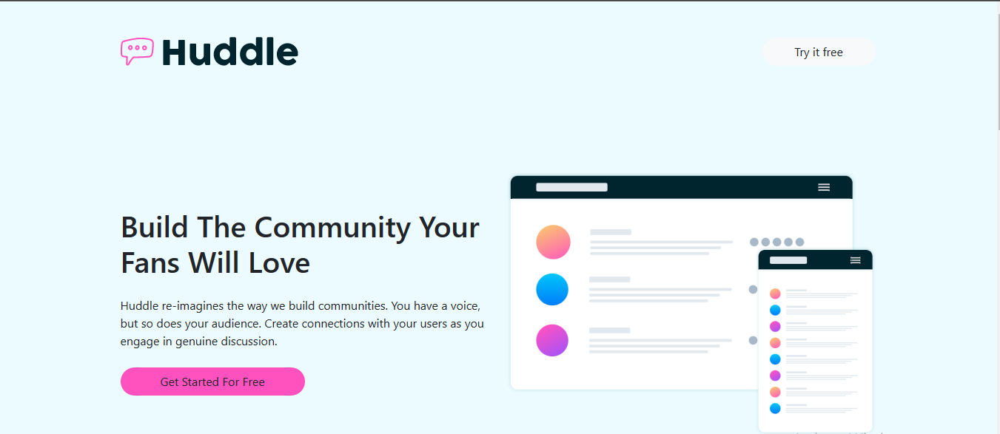
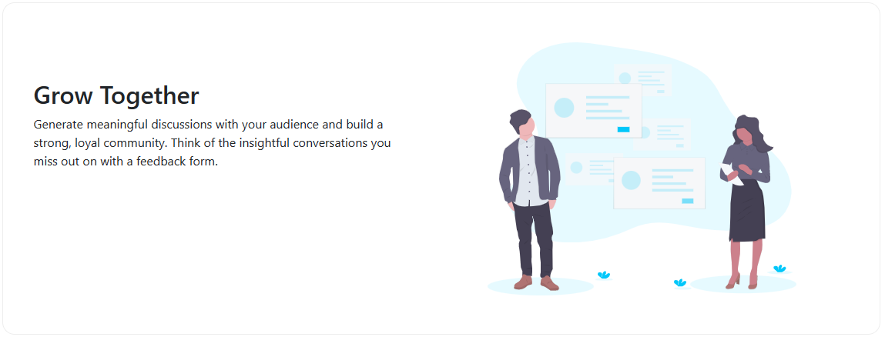
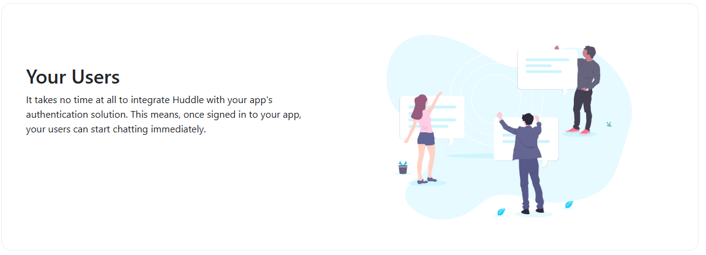
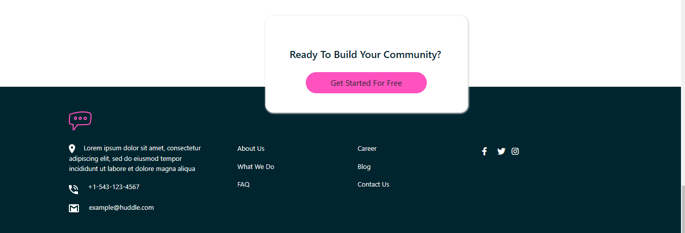

## The file name of the project is "huddle-landing-page-with-alternating-feature-blocks-master.
### The project has five categories; a navbar, three section and a footer.
### css, html, bootstrap was used in making up the project.
### The information gotten from the landing page is about building a community named "HUDDLE"  It promote genuine discussion with you an dthe users.

